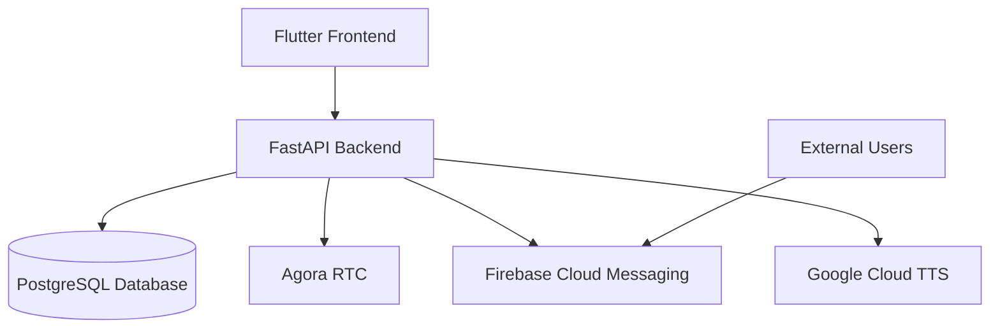
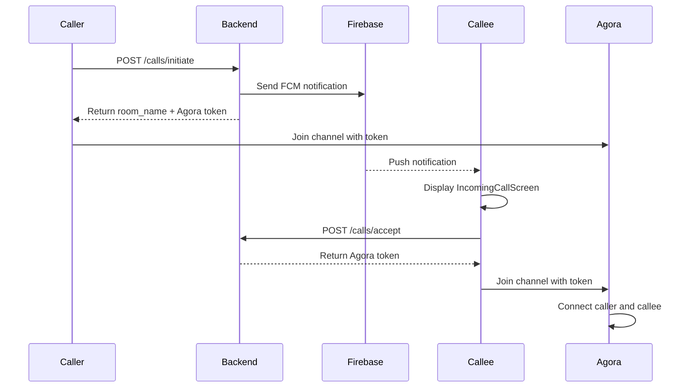
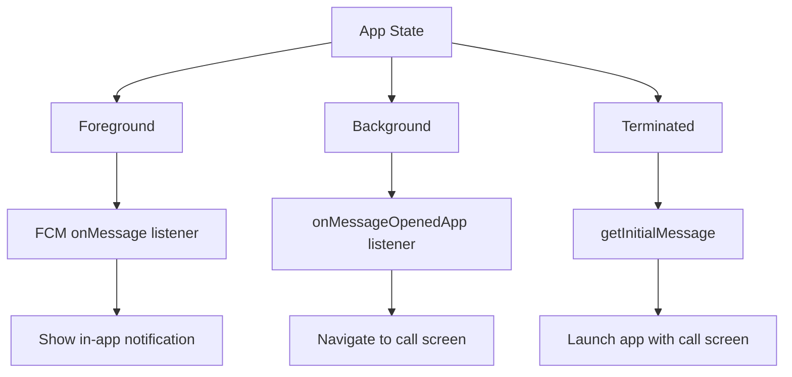
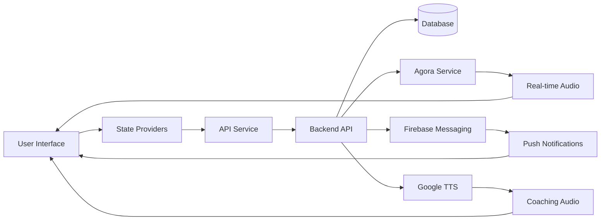

# VoiceGuardian Project Workflow

This document provides a comprehensive overview of the VoiceGuardian application workflow, covering both frontend and backend components, user journeys, and system architecture.

## Table of Contents
1. [Overview](#overview)
2. [System Architecture](#system-architecture)
3. [User Authentication Flow](#user-authentication-flow)
4. [Friend Management Workflow](#friend-management-workflow)
5. [Voice Call Workflow](#voice-call-workflow)
6. [Real-time Transcription & Coaching](#real-time-transcription--coaching)
7. [Push Notifications System](#push-notifications-system)
8. [Call History Management](#call-history-management)
9. [Data Flow Diagram](#data-flow-diagram)

## Overview

VoiceGuardian is a respectful voice conversation platform that enables users to make voice calls with real-time transcription and coaching features. The application uses Flutter for the frontend, FastAPI for the backend, Agora for real-time communication, and Firebase for push notifications.

## System Architecture

### Key Components:
- **Frontend**: Flutter application with Provider state management
- **Backend**: FastAPI server with RESTful API endpoints
- **Database**: PostgreSQL with Alembic for migrations
- **Real-time Communication**: Agora RTC Engine
- **Push Notifications**: Firebase Cloud Messaging (FCM)
- **Text-to-Speech**: Google Cloud TTS API
- **Transcription**: WebSocket-based real-time transcription service

## User Authentication Flow

1. **User Registration**
   - User opens the app and navigates to the registration screen
   - Enters username, phone number, and password
   - App sends POST request to `/api/v1/users/register`
   - Backend validates input and creates new user in database
   - Returns success response to frontend

2. **User Login**
   - User enters username and password on login screen
   - App sends POST request to `/api/v1/auth/token` with form data
   - Backend validates credentials using OAuth2
   - Returns JWT access token
   - Frontend stores token in AuthProvider and SharedPreferences
   - Registers device FCM token with backend via `/api/v1/users/register_device`

3. **Authentication Persistence**
   - On app restart, AuthProvider checks for stored JWT token
   - Validates token with backend if needed
   - Maintains user session across app launches

## Friend Management Workflow

1. **Sending Friend Requests**
   - User navigates to Friends screen
   - Searches for or enters a username
   - App sends POST request to `/api/v1/friends/request` with username
   - Backend creates pending friendship record
   - Returns success response

2. **Viewing Pending Requests**
   - Friends screen calls GET `/api/v1/friends/pending`
   - Backend returns list of pending friend requests
   - Frontend displays requests with Accept button

3. **Accepting Friend Requests**
   - User taps Accept on a pending request
   - App sends PUT request to `/api/v1/friends/accept` with friendship_id
   - Backend updates friendship status to accepted
   - Both users can now see each other in their friends list

4. **Viewing Friends List**
   - Home screen calls GET `/api/v1/friends/list`
   - Backend returns list of accepted friends
   - Frontend displays friends with Call button

## Voice Call Workflow

### Outgoing Call Process

1. **Initiating a Call**
   - User taps Call button next to a friend's name
   - App calls ApiService.initiateCall() with callee's username
   - Frontend sends POST request to `/api/v1/calls/initiate`
   - Backend:
     - Creates a unique room name
     - Generates Agora token for caller
     - Sends FCM notification to callee with call details
   - Backend returns room_name and Agora token to caller
   - Caller joins Agora channel with provided details

2. **Receiving a Call**
   - Callee receives FCM `incoming_call` notification
   - App displays IncomingCallScreen with caller details
   - When callee accepts:
     - App calls ApiService.acceptCall() with room_name
     - Frontend sends POST request to `/api/v1/calls/accept`
     - Backend generates Agora token for callee
     - Returns token to callee's app
     - Callee joins Agora channel
     - Both parties are now connected in the same Agora room

### Call Connection Flow

## Real-time Transcription & Coaching

1. **Transcription Service Initialization**
   - When call connects, AgoraCallService initializes TranscriptionService
   - TranscriptionService connects to WebSocket endpoint `/calls/transcribe_audio`
   - Sends 'start' message with channel_name and username

2. **Audio Processing**
   - AgoraCallService registers audio frame observer
   - Audio frames captured at 16kHz sample rate
   - Audio data encoded as base64 and sent via WebSocket
   - Backend processes audio with speech recognition

3. **Coaching Feedback**
   - Backend analyzes transcribed text for respectfulness
   - If inappropriate content detected, backend generates rephrased suggestion
   - Sends 'rephrase' message back via WebSocket
   - Frontend receives rephrased text and toxicity score
   - App calls ApiService.synthesizeTts() to convert rephrased text to audio
   - Plays coaching audio through Agora audio mixing

4. **Toxicity Detection**
   - Backend continuously monitors transcriptions
   - When toxic content detected, sends alert via WebSocket
   - Frontend displays warning to user
   - Updates respectfulness score accordingly

## Push Notifications System

### Notification Types

1. **Incoming Call**
   - Payload: `type: 'incoming_call'`, caller details, room_name
   - Triggers IncomingCallScreen display
   - Shows full-screen notification with accept/decline options

2. **Call Cancelled**
   - Payload: `type: 'call_cancelled'`, cancelled_by
   - Closes incoming call UI if displayed
   - Shows cancellation message

3. **Call Declined**
   - Payload: `type: 'call_declined'`, declined_by
   - Ends outgoing call attempt
   - Shows decline message to caller

### Notification Handling States

## Call History Management

1. **Recording Call Data**
   - When call ends, app calls ApiService.completeCall()
   - Sends POST request to `/api/v1/calls/complete`
   - Includes room_name, duration, ended_by
   - Backend stores call record in database

2. **Retrieving Call History**
   - History screen calls ApiService.getCallHistory()
   - Sends GET request to `/api/v1/calls/history`
   - Backend returns list of call records
   - Frontend displays with date, peer, duration, status

3. **History Data Structure**
   - Call ID
   - Participants (caller, callee)
   - Timestamp
   - Duration
   - Status (completed, missed, declined)
   - Respectfulness metrics

## Data Flow Diagram

## Error Handling & Recovery

1. **Network Failures**
   - API service implements retry mechanisms
   - Graceful degradation when backend unavailable
   - Local caching of non-critical data

2. **Call Connection Issues**
   - Agora service handles reconnection attempts
   - Timeout mechanisms for unanswered calls
   - Fallback to alternative communication methods

3. **Transcription Failures**
   - WebSocket reconnection logic
   - Local audio buffering during outages
   - Error messages to user interface

## Security Considerations

1. **Authentication**
   - JWT tokens with expiration
   - Secure storage of tokens
   - Device-specific token registration

2. **Data Protection**
   - Encrypted communication (HTTPS/WebSocket Secure)
   - Sanitization of user inputs
   - Secure storage of sensitive data

3. **Privacy**
   - User consent for audio processing
   - Data retention policies
   - GDPR compliance measures

This workflow documentation provides a comprehensive overview of how the VoiceGuardian application functions, from user authentication through voice calls with real-time coaching features.