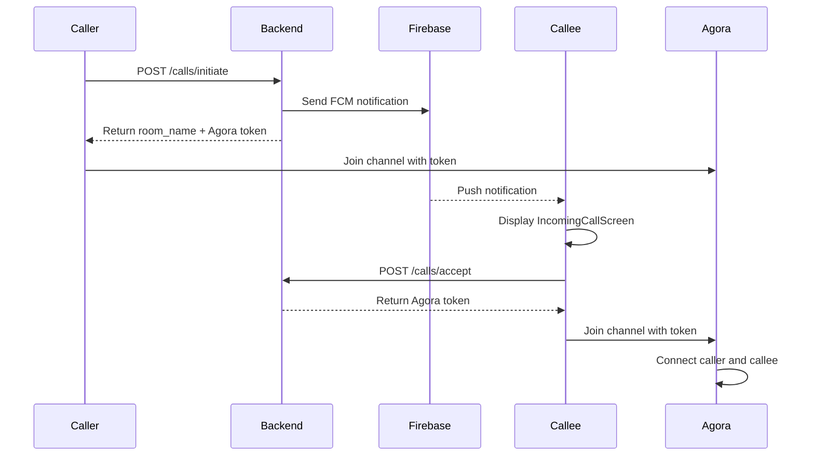

# VoiceGuardian Backend Integration Guide for React Frontend

This document provides comprehensive instructions for integrating a React frontend with the VoiceGuardian backend. It covers all available API endpoints, authentication flows, real-time communication features, and implementation details needed to build a complete frontend.

## Table of Contents
1. [Base URL Configuration](#base-url-configuration)
2. [Authentication System](#authentication-system)
3. [API Endpoints](#api-endpoints)
4. [Real-time Features](#real-time-features)
5. [Push Notifications](#push-notifications)
6. [Voice Call Workflow](#voice-call-workflow)
7. [Frontend Implementation Guide](#frontend-implementation-guide)

## Base URL Configuration

The backend API is accessible at:
```
https://criselda-endurable-nonsociably.ngrok-free.dev/api/v1
```

For local development with the Flutter app, you might see:
```
http://10.0.2.2:8000/api/v1
```

Update this URL in your React app configuration as needed.

## Authentication System

VoiceGuardian uses JWT token-based authentication.

### Registration Flow
1. User provides username, phone number, and password
2. Submit to `POST /users/register`
3. On success, automatically log the user in

### Login Flow
1. User provides username and password
2. Submit to `POST /auth/token` (form data format)
3. Receive JWT access token
4. Store token securely (localStorage/sessionStorage)
5. Register device token with `POST /users/register_device`

### Token Management
- Tokens must be included in the `Authorization: Bearer {token}` header for authenticated requests
- Tokens expire and require re-authentication
- Implement token refresh logic as needed

## API Endpoints

### User Authentication
| Endpoint | Method | Description | Auth Required |
|----------|--------|-------------|---------------|
| `/users/register` | POST | Register new user | No |
| `/auth/token` | POST | Login and get JWT token | No |
| `/users/register_device` | POST | Register FCM device token | Yes |
| `/users/me` | GET | Get current user profile | Yes |
| `/users/perspective` | PUT | Update perspective threshold | Yes |
| `/users/guest` | POST | Guest login with phone number | No |

### Friends Management
| Endpoint | Method | Description | Auth Required |
|----------|--------|-------------|---------------|
| `/friends/request` | POST | Send friend request | Yes |
| `/friends/accept` | PUT | Accept friend request | Yes |
| `/friends/reject` | PUT | Reject friend request | Yes |
| `/friends/list` | GET | List all friends | Yes |
| `/friends/pending` | GET | List pending requests | Yes |

### Voice Calls
| Endpoint | Method | Description | Auth Required |
|----------|--------|-------------|---------------|
| `/calls/initiate` | POST | Start outgoing call | Yes |
| `/calls/accept` | POST | Accept incoming call | Yes |
| `/calls/decline` | POST | Decline incoming call | Yes |
| `/calls/cancel` | POST | Cancel outgoing call | Yes |
| `/calls/complete` | POST | Mark call as completed | Yes |
| `/calls/history` | GET | Get call history | Yes |
| `/calls/agora_token` | GET | Get Agora RTC token | Yes |
| `/calls/tts` | POST | Convert text to speech | Yes |
| `/calls/transcribe_audio` | WebSocket | Real-time transcription | Yes |

### Contact Sync
| Endpoint | Method | Description | Auth Required |
|----------|--------|-------------|---------------|
| `/users/match_contacts` | POST | Match phone contacts with users | Yes |

## Real-time Features

### WebSocket Transcription Service
Endpoint: `wss://criselda-endurable-nonsociably.ngrok-free.dev/api/v1/calls/transcribe_audio`

The transcription service uses WebSockets for real-time processing:
1. Connect to WebSocket endpoint
2. Send `start` message with channel details
3. Send audio data as base64-encoded chunks
4. Receive transcription and coaching feedback

Message format:
```javascript
// Start transcription
{
  "type": "start",
  "channel_name": "unique_channel_id",
  "username": "current_user"
}

// Send audio data
{
  "type": "audio",
  "data": "base64_encoded_audio_chunk"
}

// Stop transcription
{
  "type": "stop"
}
```

Response message types:
- `ready`: Connection established
- `transcript`: Transcribed text
- `rephrase`: Coaching suggestion
- `rephrase_ready`: Rephrased text with audio
- `interim`: Partial transcription
- `toxicity_alert`: Inappropriate content detected
- `error`: Error message
- `stopped`: Transcription stopped

### Agora Integration
Agora is used for real-time voice communication:
- App ID: `91496d742dca43e596046340b9e4b4ad`
- Get tokens from `/calls/agora_token` endpoint
- Use Agora Web SDK for browser implementation

## Push Notifications

VoiceGuardian uses Firebase Cloud Messaging (FCM) for push notifications:
- Incoming call notifications
- Call cancellation/decline notifications

Notification payload structure:
```javascript
{
  "type": "incoming_call",
  "caller_name": "John Doe",
  "room_name": "unique_room_id",
  "caller_respectfulness": "0.85"
}
```

Other notification types:
- `call_cancelled`: Call was cancelled by caller
- `call_declined`: Call was declined by callee

## Voice Call Workflow

### Outgoing Call Process
1. User selects friend to call
2. Frontend calls `POST /calls/initiate` with callee username
3. Backend creates room and sends FCM notification to callee
4. Backend returns room_name and Agora token to caller
5. Caller joins Agora channel with provided token
6. When callee accepts, they get their own Agora token
7. Both parties connect in the same Agora room

### Incoming Call Process
1. FCM notification received with call details
2. Display incoming call UI
3. On accept: Call `POST /calls/accept` with room_name
4. Receive Agora token and join channel
5. On decline: Call `POST /calls/decline` with room_name

### Call Connection Flow


## Frontend Implementation Guide

### 1. Project Setup
```bash
npx create-react-app voiceguardian-frontend
cd voiceguardian-frontend
npm install axios @agoraio/sdk firebase
```

### 2. Environment Configuration
Create a `.env` file:
```env
REACT_APP_API_BASE_URL=https://criselda-endurable-nonsociably.ngrok-free.dev/api/v1
REACT_APP_AGORA_APP_ID=91496d742dca43e596046340b9e4b4ad
```

### 3. API Service Implementation
Create `src/services/apiService.js`:
```javascript
import axios from 'axios';

const API_BASE_URL = process.env.REACT_APP_API_BASE_URL;

const apiService = axios.create({
  baseURL: API_BASE_URL,
});

// Add auth token to requests
apiService.interceptors.request.use((config) => {
  const token = localStorage.getItem('authToken');
  if (token) {
    config.headers.Authorization = `Bearer ${token}`;
  }
  return config;
});

export const authService = {
  register: (username, phoneNumber, password) => 
    apiService.post('/users/register', { username, phone_number: phoneNumber, password }),
  
  login: (username, password) => {
    const formData = new FormData();
    formData.append('username', username);
    formData.append('password', password);
    return apiService.post('/auth/token', formData, {
      headers: { 'Content-Type': 'application/x-www-form-urlencoded' }
    });
  },
  
  registerDeviceToken: (fcmToken) => 
    apiService.post('/users/register_device', { fcm_token: fcmToken }),
  
  getCurrentUser: () => apiService.get('/users/me'),
  
  updatePerspectiveThreshold: (threshold) => 
    apiService.put('/users/perspective', { threshold }),
  
  guestLogin: (phoneNumber) => 
    apiService.post('/users/guest', { phone_number: phoneNumber })
};

export const friendService = {
  sendRequest: (username) => apiService.post('/friends/request', { username }),
  acceptRequest: (friendshipId) => apiService.put('/friends/accept', { friendship_id: friendshipId }),
  rejectRequest: (friendshipId) => apiService.put('/friends/reject', { friendship_id: friendshipId }),
  getFriends: () => apiService.get('/friends/list'),
  getPendingRequests: () => apiService.get('/friends/pending')
};

export const callService = {
  initiateCall: (calleeUsername) => apiService.post('/calls/initiate', { callee_username: calleeUsername }),
  acceptCall: (roomName) => apiService.post('/calls/accept', { room_name: roomName }),
  declineCall: (roomName, callerUsername) => apiService.post('/calls/decline', { room_name: roomName, caller_username }),
  cancelCall: (roomName, calleeUsername) => apiService.post('/calls/cancel', { room_name: roomName, callee_username: calleeUsername }),
  completeCall: (roomName, durationSeconds, endedBy) => apiService.post('/calls/complete', { room_name: roomName, duration_seconds: durationSeconds, ended_by: endedBy }),
  getCallHistory: (limit) => apiService.get(`/calls/history${limit ? `?limit=${limit}` : ''}`),
  getAgoraToken: (channelName, uid) => apiService.get(`/calls/agora_token?channel_name=${channelName}&uid=${uid}`),
  synthesizeTts: (text) => apiService.post('/calls/tts', { text })
};

export const contactService = {
  matchContacts: (phoneNumbers) => apiService.post('/users/match_contacts', { phone_numbers: phoneNumbers })
};
```

### 4. Authentication Context
Create `src/contexts/AuthContext.js`:
```javascript
import React, { createContext, useState, useEffect, useContext } from 'react';
import { authService } from '../services/apiService';

const AuthContext = createContext();

export const useAuth = () => {
  const context = useContext(AuthContext);
  if (!context) {
    throw new Error('useAuth must be used within an AuthProvider');
  }
  return context;
};

export const AuthProvider = ({ children }) => {
  const [user, setUser] = useState(null);
  const [loading, setLoading] = useState(true);
  const [token, setToken] = useState(null);

  useEffect(() => {
    const storedToken = localStorage.getItem('authToken');
    if (storedToken) {
      setToken(storedToken);
      // Load user profile
      loadUserProfile(storedToken);
    } else {
      setLoading(false);
    }
  }, []);

  const loadUserProfile = async (authToken) => {
    try {
      const response = await authService.getCurrentUser();
      setUser(response.data);
    } catch (error) {
      console.error('Failed to load user profile:', error);
      logout();
    } finally {
      setLoading(false);
    }
  };

  const login = async (username, password) => {
    try {
      const response = await authService.login(username, password);
      const { access_token } = response.data;
      localStorage.setItem('authToken', access_token);
      setToken(access_token);
      await loadUserProfile(access_token);
      return { success: true };
    } catch (error) {
      return { success: false, error: error.response?.data?.detail || 'Login failed' };
    }
  };

  const register = async (username, phoneNumber, password) => {
    try {
      await authService.register(username, phoneNumber, password);
      // Auto-login after registration
      return await login(username, password);
    } catch (error) {
      return { success: false, error: error.response?.data?.detail || 'Registration failed' };
    }
  };

  const logout = () => {
    localStorage.removeItem('authToken');
    setToken(null);
    setUser(null);
  };

  const value = {
    user,
    token,
    loading,
    login,
    register,
    logout
  };

  return (
    <AuthContext.Provider value={value}>
      {children}
    </AuthContext.Provider>
  );
};
```

### 5. Firebase Integration
Create `src/services/firebaseService.js`:
```javascript
import { initializeApp } from 'firebase/app';
import { getMessaging, getToken, onMessage } from 'firebase/messaging';

// Firebase configuration (replace with your actual config)
const firebaseConfig = {
  // Add your Firebase config here
};

const app = initializeApp(firebaseConfig);
const messaging = getMessaging(app);

export const initializeFirebase = () => {
  return { app, messaging };
};

export const requestFirebaseToken = async () => {
  try {
    const currentToken = await getToken(messaging, { vapidKey: 'YOUR_VAPID_KEY' });
    if (currentToken) {
      return currentToken;
    } else {
      console.log('No registration token available. Request permission to generate one.');
      return null;
    }
  } catch (err) {
    console.log('An error occurred while retrieving token. ', err);
    return null;
  }
};

export const onMessageListener = () =>
  new Promise((resolve) => {
    onMessage(messaging, (payload) => {
      resolve(payload);
    });
  });
```

### 6. Voice Call Component
Create `src/components/VoiceCall.js`:
```javascript
import React, { useState, useEffect, useRef } from 'react';
import AgoraRTC from 'agora-rtc-sdk-ng';
import { callService } from '../services/apiService';

const VoiceCall = ({ roomName, isCaller, onEndCall }) => {
  const [isMuted, setIsMuted] = useState(false);
  const [isSpeakerOn, setIsSpeakerOn] = useState(true);
  const [remoteUser, setRemoteUser] = useState(null);
  const [callStatus, setCallStatus] = useState('connecting');
  
  const clientRef = useRef(null);
  const localAudioTrackRef = useRef(null);
  const remoteAudioTrackRef = useRef(null);

  useEffect(() => {
    initializeAgora();
    
    return () => {
      cleanupAgora();
    };
  }, []);

  const initializeAgora = async () => {
    try {
      // Create Agora client
      const client = AgoraRTC.createClient({ mode: 'rtc', codec: 'vp8' });
      clientRef.current = client;

      // Handle user published event
      client.on('user-published', async (user, mediaType) => {
        await client.subscribe(user, mediaType);
        
        if (mediaType === 'audio') {
          setRemoteUser(user);
          // Play remote audio
          const remoteAudioTrack = user.audioTrack;
          remoteAudioTrack.play();
          remoteAudioTrackRef.current = remoteAudioTrack;
        }
      });

      // Handle user left event
      client.on('user-left', (user) => {
        if (remoteUser && user.uid === remoteUser.uid) {
          setRemoteUser(null);
          if (remoteAudioTrackRef.current) {
            remoteAudioTrackRef.current.stop();
          }
        }
      });

      // Get Agora token
      const uid = isCaller ? 1 : 2; // Simplified UID assignment
      const response = await callService.getAgoraToken(roomName, uid);
      const { token } = response.data;

      // Join channel
      await client.join(process.env.REACT_APP_AGORA_APP_ID, roomName, token, uid);
      
      // Create and publish local audio track
      const localAudioTrack = await AgoraRTC.createMicrophoneAudioTrack();
      await client.publish([localAudioTrack]);
      localAudioTrackRef.current = localAudioTrack;
      
      setCallStatus('connected');
    } catch (error) {
      console.error('Agora initialization error:', error);
      setCallStatus('error');
    }
  };

  const cleanupAgora = async () => {
    if (localAudioTrackRef.current) {
      localAudioTrackRef.current.close();
    }
    if (remoteAudioTrackRef.current) {
      remoteAudioTrackRef.current.stop();
    }
    if (clientRef.current) {
      await clientRef.current.leave();
    }
  };

  const toggleMute = () => {
    if (localAudioTrackRef.current) {
      localAudioTrackRef.current.setEnabled(isMuted);
      setIsMuted(!isMuted);
    }
  };

  const toggleSpeaker = () => {
    // Speaker functionality depends on device capabilities
    setIsSpeakerOn(!isSpeakerOn);
  };

  const endCall = async () => {
    try {
      await cleanupAgora();
      onEndCall();
    } catch (error) {
      console.error('Error ending call:', error);
    }
  };

  return (
    <div className="voice-call-container">
      <div className="call-header">
        <h2>Voice Call</h2>
        <p>Status: {callStatus}</p>
      </div>
      
      <div className="call-controls">
        <button onClick={toggleMute} className={isMuted ? 'muted' : ''}>
          {isMuted ? 'Unmute' : 'Mute'}
        </button>
        
        <button onClick={toggleSpeaker} className={isSpeakerOn ? 'speaker-on' : 'speaker-off'}>
          Speaker
        </button>
        
        <button onClick={endCall} className="end-call">
          End Call
        </button>
      </div>
    </div>
  );
};

export default VoiceCall;
```

### 7. Main App Component
Update `src/App.js`:
```javascript
import React from 'react';
import { AuthProvider } from './contexts/AuthContext';
import { BrowserRouter as Router, Routes, Route } from 'react-router-dom';
import LoginScreen from './components/LoginScreen';
import RegisterScreen from './components/RegisterScreen';
import MainScreen from './components/MainScreen';
import ProtectedRoute from './components/ProtectedRoute';

function App() {
  return (
    <AuthProvider>
      <Router>
        <div className="App">
          <Routes>
            <Route path="/login" element={<LoginScreen />} />
            <Route path="/register" element={<RegisterScreen />} />
            <Route 
              path="/" 
              element={
                <ProtectedRoute>
                  <MainScreen />
                </ProtectedRoute>
              } 
            />
          </Routes>
        </div>
      </Router>
    </AuthProvider>
  );
}

export default App;
```

## Implementation Notes

### 1. Authentication Flow
- Store JWT tokens in localStorage or sessionStorage
- Implement automatic token refresh if needed
- Handle token expiration gracefully
- Register FCM tokens after login

### 2. Real-time Communication
- Use Agora Web SDK for voice calls
- Implement WebSocket connection for transcription service
- Handle audio streaming to WebSocket endpoint
- Process coaching feedback from backend

### 3. Push Notifications
- Integrate Firebase Messaging for push notifications
- Handle different notification types (incoming call, call cancelled, etc.)
- Display appropriate UI based on notification payload
- Implement notification tap handlers

### 4. Voice Call Features
- Implement mute/unmute functionality
- Add speakerphone toggle
- Handle call connection states
- Implement proper call cleanup on disconnect

### 5. Error Handling
- Implement comprehensive error handling for API calls
- Show user-friendly error messages
- Handle network connectivity issues
- Implement retry mechanisms for failed requests

## Dependencies to Install

```bash
npm install axios react-router-dom @agoraio/sdk firebase
```

## Additional Considerations

1. **Security**: Always validate and sanitize user inputs
2. **Performance**: Implement proper loading states and caching
3. **Accessibility**: Ensure UI is accessible to all users
4. **Responsive Design**: Make sure the app works on different screen sizes
5. **Testing**: Implement unit and integration tests
6. **Deployment**: Configure proper build and deployment processes

This guide provides all the necessary information to build a React frontend that integrates with the VoiceGuardian backend, including authentication, friend management, voice calls, and real-time transcription features.